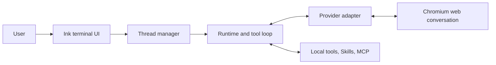

# portal

**Turn web AI products into local, tool-using terminal agents.**

[简体中文](docs/README.zh-CN.md) | [Configuration](docs/configuration.md) | [Project Instructions](docs/instructions.md) | [API](docs/api.md) | [Providers](docs/providers.md) | [Architecture](docs/architecture.md) | [Security](docs/security.md) | [Skills](docs/skills.md) | [MCP](docs/mcp.md) | [Hooks](docs/hooks.md) | [Contributing](docs/contributing.md)

> [!IMPORTANT]
> portal is an early-stage development project. Provider websites can change without notice, so passing tests do not guarantee that every real browser workflow still works.

portal launches a real Chromium-based browser, connects through Playwright and the Chrome DevTools Protocol (CDP), and drives supported web AI products through their normal websites. The web model can request local tools, receive their results, and continue in the same provider conversation.

portal does **not** call provider model APIs. It does not bypass provider accounts, subscriptions, usage limits, or terms.

## Core capabilities

- **Six web providers.** ChatGPT, Gemini, DeepSeek, Doubao, Grok, and GLM share one local thread model.
- **Real browser sessions.** A dedicated browser profile preserves login state and account-specific web features.
- **Local tools.** Models can inspect a workspace, run commands, edit files, attach images, and delegate focused tasks.
- **Resumable conversations.** portal stores conversation URLs and reloads visible provider history when a conversation is resumed.
- **Isolated timelines.** Home and every open thread keep separate in-memory terminal timelines; switching restores cached output without reloading the provider.
- **Project instructions.** Optional Codex and Claude Code files can provide reviewed workspace guidance to new runtimes.
- **Skills and MCP.** Runtimes can load registered instruction packages and connect to stdio or Streamable HTTP MCP servers.
- **Lifecycle Hooks.** Command, prompt, and isolated agent handlers can observe lifecycle events or allow, deny, and rewrite Tool parameters.

## How it works



For each normal user turn, portal submits text through the provider website, captures streamed output, and looks for one optional `<tool>...</tool>` request. If a tool is requested, portal executes it and sends the result back into the same web conversation. This loop can repeat until the model returns a normal assistant response.

See [Architecture](docs/architecture.md) for the runtime, thread, resume, and shutdown lifecycles.

## Supported providers

| Provider | Streaming | History on resume | File/image upload | Model selection | Capability controls               |
| -------- | --------- | ----------------- | ----------------- | --------------- | --------------------------------- |
| ChatGPT  | Yes       | Yes               | Yes               | Yes             | Page actions when available       |
| Gemini   | Yes       | Yes               | Yes               | Yes             | Dynamic page actions              |
| DeepSeek | Yes       | Yes               | Yes               | Yes             | Thinking and search toggles       |
| Doubao   | Yes       | Yes               | Yes               | Yes             | Dynamic page actions              |
| Grok     | Yes       | Yes               | Yes               | Yes             | None currently exposed            |
| GLM      | Yes       | Yes               | Yes               | Yes             | Thinking, search, advanced search |

Support means that an adapter exists in this repository. Actual availability depends on the account, region, subscription, provider experiment, and current page structure. Model numbers and page actions are based on the menus visible to the current account.

See [Providers](docs/providers.md) for accepted conversation URLs, model-number syntax, capabilities, response transports, and resume-history behavior.

## Requirements

- Node.js 22 or newer
- npm
- Git
- Google Chrome or another supported Chromium-based browser
- A valid account for each provider you use

Windows, macOS, and Linux are supported launch environments. Browser executable discovery and the default command shell use the conventions of the current platform.

## Quick start

From a local clone:

```bash
npm install
npm run dev
```

On first run, portal creates a commented `data/config.yaml` covering the browser, project instructions, HTTP API, MCP, Skills, Hooks, and advanced runtime limits. Project instruction sources are disabled by default. See [Configuration](docs/configuration.md). The generated `browser.profilePath` is an absolute path under `data/profiles/<browser.name>`; with the default `edge` browser, it points to `data/profiles/edge`.

Override the browser name, executable, or port when needed:

```text
npm run dev -- --browser-name chrome --browser-executable-path "<browser executable path>" --browser-remote-debugging-port 9222
```

Supported browser names are `chromium`, `chrome`, and `edge`. Both `browser.executablePath` and `browser.profilePath` accept absolute or relative paths; generated defaults are absolute and use platform-native browser locations, while configured relative values resolve from portal's working directory. Run `npm run dev -- --help` for all startup options.

portal opens on the command help screen. Create a thread and enter a normal task:

```text
/providers
/thread open chatgpt
Summarize this repository and identify its highest-risk module.
```

If the provider is signed out, complete login in the browser window. portal keeps checking the same adapter page and dedicated profile.

## Threads and resume

Open and manage local threads:

```text
/thread open gemini
/thread open chatgpt 1
/thread list
/thread switch t-1
/thread status
/thread reload
/thread detach
/thread close
/thread close t-1
```

Resume from a provider URL or a local history id:

```text
/thread history
/thread resume #1
/thread resume https://chatgpt.com/c/...
```

On a successful open or resume, the new thread timeline starts with the existing `Thread t-N is ready.` status bubble. Resume then appends the visible user/assistant history from the provider's current conversation branch. Tool nodes, hidden setup messages, reasoning, and unsupported attachment content are not rendered as ordinary history messages.

`data/threads.db` stores only provider metadata, conversation URLs, titles, and timestamps. It is not a transcript database. Remote history and terminal timelines remain in memory; after portal restarts, use `/thread resume` to load the provider conversation again. Switching among already open threads restores their cached timelines without another provider request.

### Thread commands

| Command                                       | Behavior                                                     |
| --------------------------------------------- | ------------------------------------------------------------ |
| `/thread open <provider> [model]`             | Open a new provider conversation and run the setup handshake |
| `/thread list`                                | List open local threads and local turn counts                |
| `/thread history [limit]`                     | List recent conversation URL records from SQLite             |
| `/thread resume <url\|#history-id>`           | Reopen a provider conversation and display remote history    |
| `/thread switch <thread-id>`                  | Restore another open thread's in-memory timeline             |
| `/thread status`                              | Show the active thread                                       |
| `/thread reload`                              | Reload the active provider page without creating a turn      |
| `/thread close [thread-id]`                   | Close the selected thread, or the active thread by default   |
| `/thread detach`                              | Return to the home timeline without closing the thread       |
| `/thread capability [name] [on\|off\|status]` | Inspect or change provider-specific web controls             |

Remote messages loaded by resume are display-only and do not increase the local turn count shown by `/thread list`.

## Commands

| Command         | Purpose                                             |
| --------------- | --------------------------------------------------- |
| `/help`         | Show top-level command help                         |
| `/providers`    | List supported provider ids                         |
| `/thread ...`   | Open, resume, switch, inspect, detach, and close    |
| `/skill ...`    | Add, list, enable, disable, and remove Skills       |
| `/mcp ...`      | Manage MCP servers and attach Resources or Prompts  |
| `/serve ...`    | Start and manage the local HTTP API                 |
| `/job`          | List running `run_command` jobs                     |
| `/job stop ...` | Stop one running `run_command` job                  |
| `/hook ...`     | Inspect, reload, enable, or disable lifecycle Hooks |
| `/exit`         | Shut down portal                                    |

Top-level commands and first-level subcommands support unique-prefix completion with `Tab`.

## Input controls

| Key                      | Behavior                                                     |
| ------------------------ | ------------------------------------------------------------ |
| `Enter`                  | Submit the current input while idle                          |
| `Ctrl+Enter` or `Ctrl+J` | Insert a newline                                             |
| Paste                    | Preserve multiline layout and normalize Windows line endings |
| `Up` / `Down`            | Move vertically to input boundaries, or browse input history |
| `Tab`                    | Complete a unique command, subcommand, provider, or `$skill` |
| `Ctrl+W`                 | Delete the previous word                                     |
| `Ctrl+U` or `Esc`        | Clear the current input                                      |
| `Ctrl+C`                 | Cancel busy work; while idle with input, clear that input    |
| `Ctrl+D`                 | Exit while idle and the input is empty                       |

Input can be edited while portal is busy, but it cannot be submitted until the operation finishes or is cancelled.

## Built-in tools

| Tool              | Purpose                                                                 |
| ----------------- | ----------------------------------------------------------------------- |
| `attach_image`    | Attempt to attach a local image to the active provider conversation     |
| `run_command`     | Execute the platform's available shell and return structured output     |
| `apply_patch`     | Apply V4A Add/Update patches to one or more UTF-8 files                 |
| `spawn`           | Run a focused synchronous task in a temporary child conversation        |
| `load_skill`      | Load one exact Skill from the runtime catalog when Skills are available |
| `mcp_search_tool` | Load one exact MCP tool definition                                      |
| `mcp_call_tool`   | Call one exact MCP tool on a connected server                           |

`run_command` streams a small live stdout/stderr tail into a temporary terminal bubble, then replaces it with a compact completion summary. The complete bounded structured result is still returned to the web model. Cancelling the current turn with `Ctrl+C` only detaches that turn's waiter; the command remains an active portal job. Use `/job` to inspect active jobs and `/job stop <job-id>` to stop one. Controlled portal shutdown (`/exit`, idle `Ctrl+D`, or process shutdown handling) stops all jobs. Jobs are not persisted across portal restarts, and forcibly killing portal can bypass cleanup guarantees.

> [!WARNING]
> portal is not a sandbox. `run_command`, `apply_patch`, MCP tools, Skills, and spawned workers can operate with the permissions of the user running portal. There is no human approval gate before a valid model-generated tool call executes. Read [Security](docs/security.md) before using portal with sensitive data.

## Skills

Skills are local instruction packages with a `SKILL.md` manifest and optional resources. Enabled metadata is snapshotted when a new runtime is created; the model can load the current instructions on demand with `load_skill`.

```text
/skill add <local-directory-or-url>
/skill add <name> --registry <url>
/skill list
/skill enable <name>
/skill disable <name>
/skill remove <name>
$<name> [task]
```

Local directories are referenced in place. A local directory, GitHub location, or supported archive may contain one Skill or a collection of Skill directories. Direct `SKILL.md` URLs, GitHub locations, supported archives, and Hub registry packages are downloaded under `data/skills/`. A `$<name> [task]` prefix selects one enabled Skill for the current turn. See [Skills](docs/skills.md) for discovery rules, validation, source types, manual selection, runtime snapshots, storage, and trust boundaries.

## MCP

portal supports stdio and Streamable HTTP MCP servers. The current `per-thread` strategy gives every new, resumed, or spawned runtime fresh independent connections from the `mcp.servers` section of `data/config.yaml`.

```text
/mcp add <name> <url> [--header "Name: value"]...
/mcp add <name> -- <command> [args...]
/mcp list
/mcp enable <name>
/mcp disable <name>
/mcp remove <name>
/mcp resource list [server]
/mcp resource attach <server> <uri>
/mcp prompt list [server]
/mcp prompt attach <server> <prompt> [json-arguments]
```

Only successfully connected server and tool names are included under `# MCP Servers`. The model loads one exact schema through `mcp_search_tool` before calling `mcp_call_tool`. Resource and Prompt attachments are user-driven and each occupies one complete user turn. See [MCP](docs/mcp.md) for configuration, environment placeholders, lifecycle, output limits, and failure semantics.

## Local data

```text
data/
├── profiles/<browserName>/   # Dedicated browser profile and login state
├── threads.db                # Conversation URL metadata, not transcripts
├── config.yaml               # Browser, instructions, API, MCP, Skills, Hooks, and limits
├── skills/                   # portal-managed remote Skills
└── temp/skill-install/       # Temporary Skill installation workspace
```

These paths are ignored by Git but can contain sensitive local state. The repository's top-level `temp/` directory is separate and contains provider fixtures, probes, screenshots, and other development artifacts.

## Development

```bash
npm test              # Type-check, then run all unit/integration tests
npm run test:type     # TypeScript only
npm run test:unit     # node:test + tsx
npm run fmt:check     # Check Prettier formatting
npm run fmt           # Format the repository
```

Tests cover commands, thread state, timeline rendering, provider parsers, runtime recovery, Skills, MCP, tools, cancellation, and platform helpers. Real provider changes still require a browser smoke check because upstream websites can change independently.

See [Contributing](docs/contributing.md) before modifying provider selectors, history capture, tool execution, Skills, MCP, or security-sensitive behavior.

## Current limitations

- Provider selectors, private web protocols, and menu positions can change without notice.
- Resume history displays the provider's current visible user/assistant branch, not every tool, reasoning, file, image, or alternate branch node.
- Home and thread timelines are in memory only.
- A resumed conversation skips the setup handshake and assumes the original conversation already contains portal's tool protocol.
- A resumed thread does not resend current project instructions into the existing provider conversation.
- portal is not packaged as a stable globally installed CLI, and automated real-browser CI is not yet available.

## License

portal is available under the [MIT License](LICENSE).

## Disclaimer

portal is an independent project and is not affiliated with, endorsed by, or sponsored by OpenAI, Google, DeepSeek, ByteDance, xAI, Zhipu AI, or the supported web products. Users are responsible for complying with provider terms and applicable law.
