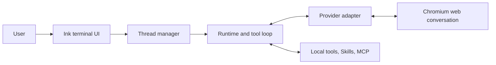

# portal

**Turn web AI products into local, tool-using terminal agents.**

[简体中文](docs/README.zh-CN.md)

> [!IMPORTANT]
> portal is an early-stage project. Provider websites can change without notice, so passing tests cannot guarantee that every real browser workflow still works.

portal launches a real Chromium-based browser and drives supported AI products through their normal websites. The web model can request local tools, receive their results, and continue in the same provider conversation.

portal does **not** call provider model APIs or bypass provider accounts, subscriptions, usage limits, or terms.

## Core capabilities

- **One terminal workflow for eight web providers.** Open, switch, and resume provider conversations through a shared thread model.
- **Persistent browser sessions.** A dedicated browser profile keeps login state and account-specific web features.
- **Local tool use.** Models can inspect a workspace, run commands, edit files, attach images, and delegate focused tasks.
- **Workspace context and extensions.** Project instructions, Skills, MCP servers, and lifecycle Hooks can shape each runtime.
- **Local integrations.** Optional HTTP API and Portal MCP Server interfaces expose selected thread operations.

## Supported providers

portal supports ChatGPT, Gemini, DeepSeek, Doubao, Grok, GLM, Qwen, and Kimi through their web interfaces.

Model, upload, and page capability availability depends on the current account, region, subscription, and provider UI. See [Providers](docs/providers.md) for supported URLs, model syntax, capabilities, response capture, and history behavior.

## Requirements

- Node.js 24 or newer
- npm and Git
- Google Chrome or another supported Chromium-based browser
- A valid account for each provider you use

Windows, macOS, and Linux are supported launch environments.

## Quick start

From a local clone:

```bash
npm install
npm run dev
```

On first run, portal creates a commented `data/config.yaml` and a dedicated browser profile. Open a thread, complete login in the browser when needed, and enter a normal task:

```text
/thread open chatgpt
Summarize this repository and identify its highest-risk module.
```

Use `/help` for the command index. See the [CLI guide](docs/cli.md) for threads, resume, input controls, background jobs, and startup options.

> [!WARNING]
> portal is not a sandbox. Local tools, Skills, Hooks, MCP servers, and spawned workers run with the permissions of the portal user, and valid model-generated tool calls have no human approval gate. Read [Security](docs/security.md) before using portal with sensitive data.

## How it works



For each user turn, portal submits text through the provider website, captures the streamed response, and looks for an optional `<tool>...</tool>` request. It executes requested local tools and returns their results to the same conversation until the model produces a normal response.

See [Architecture](docs/architecture.md) for the runtime, thread, resume, and shutdown lifecycles.

## Using portal

Common thread operations:

```text
/providers
/thread open gemini
/thread list
/thread switch t-1
/thread history
/thread resume #1
/thread close
```

Conversation URLs and metadata are stored in `data/threads.db`; transcripts are not. Open-thread terminal timelines are lost when portal exits. `/thread resume` reloads only the provider's current visible user/assistant history.

Use `Ctrl+J` for a reliable multiline input and `Ctrl+C` to cancel the current operation. Input submission remains unavailable while portal is busy. The command index and input controls are documented in the [CLI guide](docs/cli.md).

## Extensions

- **Project instructions** load reviewed Codex or Claude Code workspace guidance into new runtimes.
- **Skills** provide local instruction packages that models can load on demand.
- **MCP** connects each runtime to configured stdio or Streamable HTTP servers.
- **Hooks** observe lifecycle events or allow, deny, and rewrite tool parameters.
- **Built-in tools** cover images, shell commands, file patches, focused child tasks, Skills, and MCP calls.

Each mechanism has different trust and lifecycle boundaries. Follow the detailed documentation before enabling it.

## Documentation

- **Using portal:** [CLI](docs/cli.md), [Configuration](docs/configuration.md), [Providers](docs/providers.md), [Project Instructions](docs/instructions.md)
- **Extending runtimes:** [Skills](docs/skills.md), [MCP client](docs/mcp.md), [Hooks](docs/hooks.md)
- **Integrating portal:** [HTTP API](docs/api.md), [Portal MCP Server](docs/mcp-server.md)
- **Internals and safety:** [Architecture](docs/architecture.md), [Security](docs/security.md), [Testing](docs/testing.md)
- **Contributing:** [Contributing guide](docs/contributing.md), [Provider development](docs/provider-development.md)

## Current limitations

- Provider selectors, private web protocols, and menus can change without notice.
- Resume displays the provider's current visible user/assistant branch; unsupported content and alternate branches are filtered.
- Home and thread timelines are in memory only.
- Resume assumes that the existing conversation already contains portal's tool protocol; it skips the setup handshake and does not resend current project instructions.
- portal is not packaged as a stable global CLI, and automated real-browser CI is not yet available.

## License

portal is available under the [MIT License](LICENSE).

## Disclaimer

portal is an independent project and is not affiliated with, endorsed by, or sponsored by OpenAI, Anthropic, Google, DeepSeek, ByteDance, xAI, Zhipu AI, Moonshot AI, or the supported web products. Users are responsible for complying with provider terms and applicable law.
