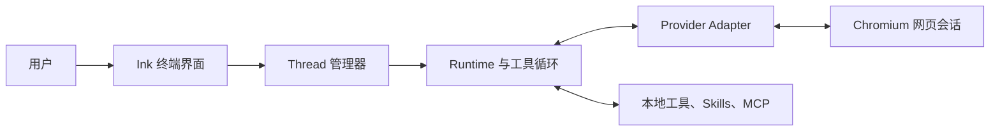

# portal

**把网页 AI 产品变成具备本地工具能力的终端 Agent。**

[English](../README.md)

> [!IMPORTANT]
> portal 仍处于早期开发阶段。网页 Provider 可以随时改变页面结构，因此测试通过并不代表所有真实浏览器流程一定可用。

portal 会启动真实的 Chromium 系浏览器，通过正常网页界面驱动支持的 AI 产品。网页模型可以请求本地工具、接收执行结果，然后在同一个 Provider 会话中继续工作。

portal **不会**调用 Provider 的模型 API，也不会绕过账号、订阅、额度或服务条款。

## 核心能力

- **统一管理八个网页 Provider。** 通过同一套 thread 模型创建、切换和恢复 Provider 会话。
- **持久浏览器会话。** 专用浏览器 profile 会保留登录状态和账号当前可用的网页能力。
- **使用本地工具。** 模型可以检查工作区、执行命令、编辑文件、附加图片和委派独立任务。
- **工作区上下文与扩展。** 项目指令、Skills、MCP Server 和生命周期 Hooks 可以影响每个 runtime。
- **本地集成接口。** 可选的 HTTP API 和 Portal MCP Server 可以暴露部分 thread 操作。

## 支持的 Provider

portal 通过网页界面支持 ChatGPT、Gemini、DeepSeek、豆包、Grok、GLM、Qwen 和 Kimi。

模型、上传和页面能力取决于当前账号、地区、订阅和 Provider 页面。支持的 URL、模型语法、Capability、响应捕获和历史行为请参阅 [Providers 文档](providers.md)。

## 环境要求

- Node.js 24 或更高版本
- npm 和 Git
- Google Chrome 或其它受支持的 Chromium 系浏览器
- 需要使用的各 Provider 账号

Windows、macOS 和 Linux 都是支持的启动环境。

## 快速开始

在本地 clone 中执行：

```bash
npm install
npm run dev
```

首次运行时，portal 会创建带注释的 `data/config.yaml` 和专用浏览器 profile。创建 thread，在需要时通过浏览器完成登录，然后直接输入普通任务：

```text
/thread open chatgpt
总结当前仓库，并找出风险最高的模块。
```

使用 `/help` 查看命令索引。Thread、Resume、输入控制、后台 job 和启动参数详见 [CLI 指南](cli.md)。

> [!WARNING]
> portal 不是沙箱。本地工具、Skills、Hooks、MCP Server 和 spawn worker 会使用 portal 用户的权限运行，合法的模型工具调用在执行前没有人工确认步骤。处理敏感数据前请阅读[安全说明](security.md)。

## 工作原理



每个用户输入都会通过 Provider 网页提交。portal 捕获流式回复并查找可选的 `<tool>...</tool>` 请求，执行需要的本地工具，再把结果回灌到同一个会话，直到模型返回普通回复。

完整的 runtime、thread、resume 和关闭流程请参阅[架构文档](architecture.md)。

## 使用 portal

常用 thread 操作：

```text
/providers
/thread open gemini
/thread list
/thread switch t-1
/thread history
/thread resume #1
/thread close
```

会话 URL 和元信息保存在 `data/threads.db` 中，聊天记录不会写入该数据库。已打开 thread 的终端时间线会在 portal 退出时丢失；`/thread resume` 只重新加载 Provider 当前可见的 user/assistant 历史。

使用 `Ctrl+J` 可靠地输入换行，使用 `Ctrl+C` 取消当前操作。portal busy 时不能提交输入。命令索引和输入控制请参阅 [CLI 指南](cli.md)。

## 扩展能力

- **项目指令**把经过审查的 Codex 或 Claude Code 工作区规则加载到新 runtime。
- **Skills**提供模型可以按需读取的本地指令包。
- **MCP**为每个 runtime 连接配置的 stdio 或 Streamable HTTP Server。
- **Hooks**观察生命周期事件，或允许、拒绝和重写工具参数。
- **内置工具**覆盖图片、Shell 命令、文件 Patch、独立子任务、Skills 和 MCP 调用。

这些机制具有不同的信任与生命周期边界，启用前请阅读对应的详细文档。

## 文档

- **使用 portal：** [CLI](cli.md)、[配置](configuration.md)、[Providers](providers.md)、[项目指令](instructions.md)
- **扩展 runtime：** [Skills](skills.md)、[MCP Client](mcp.md)、[Hooks](hooks.md)
- **集成 portal：** [HTTP API](api.md)、[Portal MCP Server](mcp-server.md)
- **内部实现与安全：** [架构](architecture.md)、[安全说明](security.md)、[测试](testing.md)
- **参与贡献：** [贡献指南](contributing.md)、[Provider 开发](provider-development.md)

## 当前限制

- Provider selector、网页私有协议和菜单可以随时变化。
- Resume 只展示 Provider 当前可见的 user/assistant 分支，不支持的内容和其它分支会被过滤。
- Home 和 thread 时间线只保存在内存中。
- Resume 假定原会话已经包含 portal 工具协议；它会跳过 setup handshake，也不会重新发送当前项目指令。
- portal 还没有稳定的全局 CLI 安装包，也没有自动化的真实浏览器 CI。

## 许可证

portal 使用 [MIT License](../LICENSE) 开源。

## 免责声明

portal 是独立项目，与 OpenAI、Anthropic、Google、DeepSeek、字节跳动、xAI、智谱 AI、月之暗面或其网页产品不存在隶属、赞助或官方认可关系。使用者需要自行遵守 Provider 条款和适用法律。
