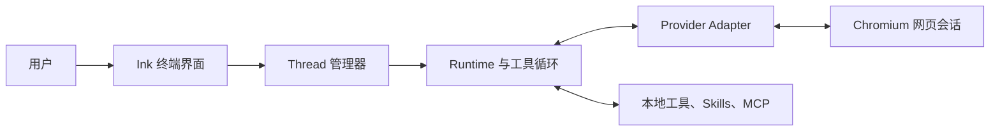

# portal

**把网页 AI 产品变成具备本地工具能力的终端 Agent。**

[English](../README.md) | [API](api.md) | [Providers](providers.md) | [架构](architecture.md) | [安全说明](security.md) | [Skills](skills.md) | [MCP](mcp.md) | [Hooks](hooks.md) | [贡献指南](contributing.md)

> [!IMPORTANT]
> portal 仍处于早期开发阶段。网页 Provider 可以随时改变页面结构，因此测试通过并不代表所有真实浏览器流程一定可用。

portal 会启动真实的 Chromium 系浏览器，通过 Playwright 和 Chrome DevTools Protocol（CDP）连接浏览器，并从正常网页界面驱动支持的 AI 产品。网页模型可以请求本地工具、接收执行结果，然后在同一个 Provider 会话中继续工作。

portal **不会**调用 Provider 的模型 API，也不会绕过账号、订阅、额度或服务条款。

## 核心能力

- **六个网页 Provider。** ChatGPT、Gemini、DeepSeek、豆包、Grok 和 GLM 使用同一套本地 thread 模型。
- **真实浏览器会话。** 专用浏览器 profile 会保留登录状态和账号当前可用的网页能力。
- **本地工具。** 模型可以检查工作区、执行命令、编辑文件、附加图片和委派独立子任务。
- **可恢复会话。** portal 保存会话 URL，并在 resume 时重新加载 Provider 当前可见的历史。
- **隔离时间线。** home 和每个打开的 thread 都有独立的内存时间线；切换时直接恢复缓存，不重新请求 Provider。
- **Skills 与 MCP。** runtime 可以按需加载本地指令包，并连接 stdio 或 Streamable HTTP MCP Server。
- **生命周期 Hooks。** command、prompt 和隔离 agent Handler 可以观察生命周期，或允许、拒绝、重写 Tool 参数。

## 工作原理



每个普通用户输入都会通过 Provider 网页提交。portal 捕获流式输出，并查找最多一个可选的 `<tool>...</tool>` 请求；如果存在工具请求，portal 执行工具并把结果回灌到同一个网页会话。这个循环可以重复多次，直到模型返回普通 assistant 回复。

完整的 runtime、thread、resume 和关闭流程请参阅[架构文档](architecture.md)。

## 支持的 Provider

| Provider | 流式回复 | Resume 历史 | 文件/图片上传 | 模型选择 | Capability 控制          |
| -------- | -------- | ----------- | ------------- | -------- | ------------------------ |
| ChatGPT  | 支持     | 支持        | 支持          | 支持     | 页面存在时的 Action      |
| Gemini   | 支持     | 支持        | 支持          | 支持     | 动态页面 Action          |
| DeepSeek | 支持     | 支持        | 支持          | 支持     | 深度思考与搜索开关       |
| 豆包     | 支持     | 支持        | 支持          | 支持     | 动态页面 Action          |
| Grok     | 支持     | 支持        | 支持          | 支持     | 当前未开放               |
| GLM      | 支持     | 支持        | 支持          | 支持     | 思考、搜索与高级搜索开关 |

这里的“支持”表示仓库中存在对应 adapter。实际能力仍受账号、地区、订阅、Provider 灰度实验和当前页面结构影响。模型编号和 Action 都以当前账号实际显示的网页菜单为准。

可接受的会话 URL、模型编号语法、Capability、响应通道和历史恢复方式请参阅 [Providers 文档](providers.md)。

## 环境要求

- Node.js 22 或更高版本
- npm
- Git
- Google Chrome 或其它受支持的 Chromium 系浏览器
- 需要使用的各 Provider 账号

目前主要在 Windows 上开发和验证。代码中存在通用的非 Windows 启动路径，但它还不是正式记录的支持目标。

## 快速开始

在本地 clone 中执行：

```bash
npm install
npm run dev
```

首次运行时，portal 会创建 `data/config.yaml`。生成的绝对路径 `browser.profilePath` 默认位于 `data/profiles/<browser.name>`；默认浏览器为 `edge` 时，该路径指向 `data/profiles/edge`。

需要时可以覆盖浏览器名、可执行文件或端口：

```text
npm run dev -- --browser-name chrome --browser-executable-path "C:\Program Files\Google\Chrome\Application\chrome.exe" --browser-remote-debugging-port 9222
```

支持的浏览器名为 `chromium`、`chrome` 和 `edge`。`browser.executablePath` 与 `browser.profilePath` 均接受绝对路径或相对路径；自动生成的默认值使用绝对路径，手动配置的相对路径以 portal 的当前工作目录为基准解析。运行 `npm run dev -- --help` 可以查看全部启动选项。

portal 启动后首先显示命令帮助。创建 thread 后直接输入普通任务：

```text
/providers
/thread open chatgpt
总结当前仓库，并找出风险最高的模块。
```

如果 Provider 尚未登录，请在浏览器窗口中完成登录。portal 会继续检查同一个 adapter 页面和专用 profile。

## Thread 与 Resume

创建和管理当前进程中的 thread：

```text
/thread open gemini
/thread open chatgpt 1
/thread list
/thread switch t-1
/thread status
/thread reload
/thread detach
/thread close
/thread close t-1
```

通过 Provider URL 或本地 history id 恢复：

```text
/thread history
/thread resume #1
/thread resume https://chatgpt.com/c/...
```

open 或 resume 成功后，新 thread 的时间线首先显示既有的 `Thread t-N is ready.` 状态气泡。resume 随后追加 Provider 当前会话分支中可见的 user/assistant 历史。工具节点、隐藏 setup 消息、思考过程和不支持的附件内容不会被当作普通历史消息渲染。

`data/threads.db` 只保存 Provider 元信息、会话 URL、标题和时间，不是 transcript 数据库。远程历史和终端时间线只保存在内存中；portal 重启后需要重新执行 `/thread resume`。已经打开的 thread 之间切换时只恢复内存缓存，不再次请求 Provider。

### Thread 命令

| 命令                                          | 行为                                    |
| --------------------------------------------- | --------------------------------------- |
| `/thread open <provider> [model]`             | 创建网页会话并执行 setup handshake      |
| `/thread list`                                | 列出当前进程中的 thread 和本地 turn 数  |
| `/thread history [limit]`                     | 从 SQLite 列出最近的会话 URL 记录       |
| `/thread resume <url\|#history-id>`           | 重新打开 Provider 会话并展示远程历史    |
| `/thread switch <thread-id>`                  | 恢复另一个已打开 thread 的内存时间线    |
| `/thread status`                              | 显示当前 active thread                  |
| `/thread reload`                              | 重新加载当前 Provider 页面，不创建 turn |
| `/thread close [thread-id]`                   | 关闭指定 thread；默认关闭 active thread |
| `/thread detach`                              | 不关闭 thread，返回 home 时间线         |
| `/thread capability [name] [on\|off\|status]` | 查看或修改 Provider 特有的网页控制      |

resume 加载的远程消息只用于显示，不会增加 `/thread list` 中的本地 turn 数。

## 命令

| 命令            | 用途                                          |
| --------------- | --------------------------------------------- |
| `/help`         | 显示顶级命令帮助                              |
| `/providers`    | 列出支持的 Provider id                        |
| `/thread ...`   | 创建、恢复、切换、查看、detach 和关闭         |
| `/skill ...`    | 添加、列出、启用、禁用和删除 Skill            |
| `/mcp ...`      | 管理 MCP Server，并 attach Resource 或 Prompt |
| `/serve ...`    | 启动和管理本地 HTTP API                       |
| `/job`          | 列出仍在运行的 `run_command` job              |
| `/job stop ...` | 停止一个仍在运行的 `run_command` job          |
| `/hook ...`     | 查看、reload、启用或禁用生命周期 Hooks        |
| `/exit`         | 关闭 portal                                   |

顶级命令和一级子命令支持用 `Tab` 进行唯一前缀补全。

## 输入控制

| 按键                     | 行为                                   |
| ------------------------ | -------------------------------------- |
| `Enter`                  | 在空闲状态提交当前输入                 |
| `Ctrl+Enter` 或 `Ctrl+J` | 插入换行                               |
| 粘贴                     | 保留多行布局，并统一 Windows 换行符    |
| `Up` / `Down`            | 浏览输入历史                           |
| `Tab`                    | 补全唯一的命令或一级子命令             |
| `Ctrl+W`                 | 删除上一个单词                         |
| `Ctrl+U` 或 `Esc`        | 清空当前输入                           |
| `Ctrl+C`                 | 取消 busy 操作；空闲且有输入时清空输入 |
| `Ctrl+D`                 | 空闲且输入为空时退出                   |

portal busy 时仍可编辑输入，但必须等当前操作结束或取消后才能提交。

## 内置工具

| 工具              | 用途                                               |
| ----------------- | -------------------------------------------------- |
| `attach_image`    | 尝试把本地图片附加到 active Provider 会话          |
| `run_command`     | 执行 PowerShell、cmd、Bash 或 sh，并返回结构化结果 |
| `apply_patch`     | 对一个或多个 UTF-8 文件执行 V4A Add/Update Patch   |
| `spawn`           | 在临时子会话中同步执行一个独立且聚焦的任务         |
| `load_skill`      | 存在 Skill catalog 时加载一个精确 Skill            |
| `mcp_search_tool` | 加载一个精确 MCP Tool 定义                         |
| `mcp_call_tool`   | 调用已连接 Server 上的一个精确 MCP Tool            |

`run_command` 执行期间会在临时气泡中实时显示少量 stdout/stderr 尾部；完成后气泡会被简短结果替换。完整但受大小限制的结构化结果仍会返回网页模型。用 `Ctrl+C` 取消当前 turn 时，只会解除该 turn 对命令的等待，命令仍作为 portal job 继续运行。用 `/job` 查看活动 job，用 `/job stop <job-id>` 停止指定 job。通过 `/exit`、空闲状态下的 `Ctrl+D` 或其他受控关闭流程退出 portal 时，所有 job 都会被停止。job 不会跨 portal 重启持久化；强制终止 portal 可能绕过清理保证。

> [!WARNING]
> portal 不是沙箱。`run_command`、`apply_patch`、MCP Tool、Skill 和 spawn worker 都可能使用运行 portal 的用户权限操作本机。合法的模型工具调用在执行前没有人工确认步骤。处理敏感数据前请阅读[安全说明](security.md)。

## Skills

Skill 是包含 `SKILL.md` manifest 和可选资源的本地指令包。创建新 runtime 时会快照已启用 Skill 的元信息；网页模型可以通过 `load_skill` 按需读取当前指令。

```text
/skill add <local-directory-or-url>
/skill list
/skill enable <name>
/skill disable <name>
/skill remove <name>
```

本地目录保持原位引用。直接 `SKILL.md` URL、GitHub 地址和支持的压缩包会下载到 `data/skills/`。Manifest 校验、来源类型、runtime 快照、存储和信任边界请参阅 [Skills 文档](skills.md)。

## MCP

portal 支持 stdio 和 Streamable HTTP MCP Server。当前 `per-thread` 策略会让每个新建、resume 或 spawn 的 runtime 按照 `data/config.yaml` 的 `mcp` 配置创建全新的独立连接。

```text
/mcp add <name> <url> [--header "Name: value"]...
/mcp add <name> -- <command> [args...]
/mcp list
/mcp enable <name>
/mcp disable <name>
/mcp remove <name>
/mcp resource list [server]
/mcp resource attach <server> <uri>
/mcp prompt list [server]
/mcp prompt attach <server> <prompt> [json-arguments]
```

只有连接成功的 Server 名和 Tool 名会出现在 `# MCP Servers` 中。模型先通过 `mcp_search_tool` 精确加载一个 Schema，再通过 `mcp_call_tool` 调用。Resource 和 Prompt attach 完全由用户触发，并各自占用一个完整 user turn。配置、环境变量占位符、生命周期、输出限制和失败语义请参阅 [MCP 文档](mcp.md)。

## 本地数据

```text
data/
├── profiles/<browserName>/   # 专用浏览器 profile 和登录状态
├── threads.db                # 会话 URL 元信息，不是 transcript
├── config.yaml               # 用户可编辑的浏览器、MCP 和 Skill 配置
├── skills/                   # portal 管理的远程 Skill
└── temp/skill-install/       # Skill 安装临时工作区
```

这些路径已被 Git 忽略，但仍可能包含敏感本地状态。仓库顶级 `temp/` 是另一套目录，用于保存 Provider fixture、probe、截图和其它开发材料。

## 开发与验证

```bash
npm test              # 类型检查，然后运行全部单元/集成测试
npm run test:type     # 只运行 TypeScript 检查
npm run test:unit     # node:test + tsx
npm run fmt:check     # 检查 Prettier 格式
npm run fmt           # 格式化仓库
```

测试覆盖命令、thread 状态、时间线渲染、Provider parser、runtime 恢复、Skills、MCP、工具、取消和平台辅助代码。上游网页可以独立变化，因此 Provider 修改仍需要真实浏览器 smoke check。

修改 Provider selector、历史捕获、工具执行、Skills、MCP 或安全边界前，请阅读[贡献指南](contributing.md)。

## 当前限制

- Provider selector、网页私有协议和菜单位置可以随时变化。
- Resume 历史只显示当前可见的 user/assistant 分支，不覆盖全部工具、思考、文件、图片或其它分支节点。
- Home 和 thread 时间线只保存在内存中。
- Resume 会话跳过 setup handshake，并假设原会话已经包含 portal 工具协议。
- portal 还没有稳定的全局 CLI 安装包，也没有自动化的真实浏览器 CI。

## 许可证

portal 使用 [MIT License](../LICENSE) 开源。

## 免责声明

portal 是独立项目，与 OpenAI、Google、DeepSeek、字节跳动、xAI、智谱 AI 或其网页产品不存在隶属、赞助或官方认可关系。使用者需要自行遵守 Provider 条款和适用法律。
