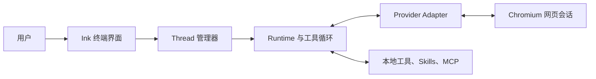

# portal

**把网页 AI 产品变成具备本地工具能力的终端 Agent。**

[English](../README.md)

portal 会启动真实的 Chromium 系浏览器，通过正常网页界面驱动支持的 AI 产品。网页模型可以请求本地工具、接收执行结果，然后在同一个 Provider 会话中继续工作。

portal **不会**调用 Provider 的模型 API，也不会绕过账号、订阅、额度或服务条款。

## 核心能力

- **统一管理八个网页 Provider。** 通过同一套 thread 模型创建、切换和恢复 Provider 会话。
- **持久浏览器会话。** 专用浏览器 profile 会保留登录状态和账号当前可用的网页能力。
- **使用本地工具。** 模型可以检查工作区、执行命令、编辑文件、附加图片和委派独立任务。
- **工作区上下文与扩展。** 项目指令、Skills、MCP Server 和生命周期 Hooks 可以影响每个 runtime。
- **本地集成接口。** 可选的 HTTP API 和 Portal MCP Server 可以暴露部分 thread 操作。

## 支持的 Provider

portal 通过网页界面支持 ChatGPT、Gemini、DeepSeek、豆包、Grok、GLM、Qwen 和 Kimi。

模型、上传和页面能力取决于当前账号、地区、订阅和 Provider 页面。支持的 URL、模型语法、Capability、响应捕获和历史行为请参阅 [Providers 文档](providers.md)。

## 环境要求

- Node.js 24 或更高版本。Windows 请使用 Node.js 24.15.0，以兼容 [nodejs/node#63638](https://github.com/nodejs/node/issues/63638)。
- npm；从源码安装时还需要 Git
- Google Chrome 或其它受支持的 Chromium 系浏览器
- 需要使用的各 Provider 账号

Windows、macOS 和 Linux 都是支持的启动环境。

## 快速开始

全局安装 portal，然后在需要它操作的工作区中启动：

```bash
npm install --global @kabxx/portal@latest
portal
```

如需临时运行而不全局安装：

```bash
npx @kabxx/portal@latest
```

也可以继续从源码运行：

```bash
git clone https://github.com/kabxx/portal.git
cd portal
npm ci
npm run dev
```

当前目录是 portal 的工作区。通过 npm 安装的 CLI 会把配置、thread 元数据、
Skills 和专用浏览器 profile 放在平台用户数据目录中。首次运行时，在需要时通过
浏览器完成 Provider 登录，创建 thread，然后直接输入普通任务：

```text
/thread agent chatgpt
总结当前仓库，并找出风险最高的模块。
```

使用 `/help` 查看命令索引。Thread 模式、Resume、输入控制、后台 job 和启动参数
详见 [CLI 指南](cli.md)；数据目录的默认位置和覆盖方式详见[配置文档](configuration.md#portal-data-directory)。

> [!WARNING]
> portal 不是沙箱。本地工具、Skills、Hooks、MCP Server 和 spawn worker 会使用 portal 用户的权限运行，合法的模型工具调用在执行前没有人工确认步骤。处理敏感数据前请阅读[安全说明](security.md)。

## 工作原理


```mermaid
flowchart LR
    U[用户] --> UI[Ink 终端界面]
    UI --> TM[Thread 管理器]
    TM --> R[Runtime 与工具循环]
    R <--> A[Provider Adapter]
    A <--> B[Chromium 网页会话]
    R <--> T[本地工具、Skills、MCP]
```

每个用户输入都会通过 Provider 网页提交。portal 捕获流式回复并查找可选的 `<tool name="tool_name">PAYLOAD</tool>` 请求，执行需要的本地工具，再把结果回灌到同一个会话，直到模型返回普通回复。

完整的 runtime、thread、resume 和关闭流程请参阅[架构文档](architecture.md)。

## 使用 portal

常用 thread 操作：

```text
/providers
/thread agent gemini
/thread list
/thread switch t-1
/thread history
/thread resume #1
/thread close
```

portal 会在数据目录中保存会话 URL 和元信息，因此 `/thread resume` 可以重新打开
Provider 当前可见的会话历史。完整的持久化和 Resume 行为请参阅 [CLI 指南](cli.md)。

使用 `Ctrl+J` 可靠地输入换行，使用 `Ctrl+C` 取消当前操作。portal busy 时不能提交输入。输入 `/` 或活动线程中的 `$` 前缀会打开最多五条的上下文提示；`Up` / `Down` 浏览提示，`Tab` 补全选中项，`Enter` 保持默认提交。命令索引和输入控制请参阅 [CLI 指南](cli.md)。

## 扩展能力

- **项目指令**把经过审查的 Codex 或 Claude Code 工作区规则加载到新 runtime。
- **Skills**提供模型可以按需读取的本地指令包。
- **MCP**为每个 runtime 连接配置的 stdio 或 Streamable HTTP Server。
- **Hooks**观察生命周期事件，或允许、拒绝和重写工具参数。
- **内置工具**覆盖图片、Shell 命令、文件 Patch、独立子任务、Skills 和 MCP 调用。

配置方法和信任边界请参阅对应文档。

## 文档

- **使用 portal：** [CLI](cli.md)、[配置](configuration.md)、[Providers](providers.md)、[项目指令](instructions.md)
- **扩展 runtime：** [Skills](skills.md)、[MCP Client](mcp.md)、[Hooks](hooks.md)
- **集成 portal：** [HTTP API](api.md)、[Portal MCP Server](mcp-server.md)
- **内部实现与安全：** [架构](architecture.md)、[安全说明](security.md)、[测试](testing.md)
- **参与贡献：** [贡献指南](contributing.md)、[Provider 开发](provider-development.md)

## 发布质量

每个版本都会构建并审计一份 npm tarball，再让 Windows、Linux 和 macOS 从同一
artifact 安装并运行测试。Windows CI 还会使用 Playwright 和临时浏览器 profile
验证 Chromium launcher 的生命周期。[Providers 文档](providers.md)持续维护各网页
产品支持的 URL、模型语法、Capability、响应捕获和历史行为。

## 许可证

portal 使用 [MIT License](../LICENSE) 开源。

## 免责声明

portal 是独立项目，与 OpenAI、Anthropic、Google、DeepSeek、字节跳动、xAI、智谱 AI、月之暗面或其网页产品不存在隶属、赞助或官方认可关系。使用者需要自行遵守 Provider 条款和适用法律。
