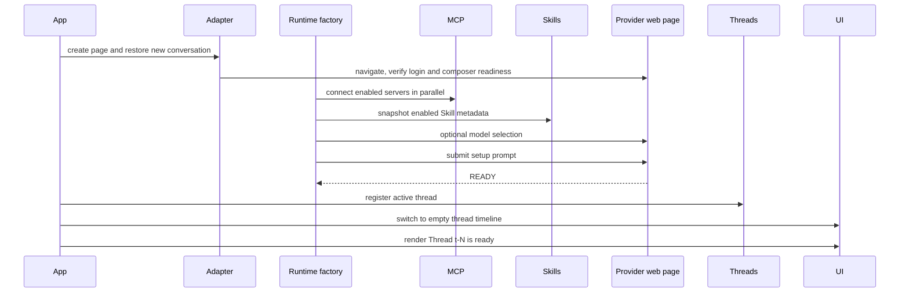
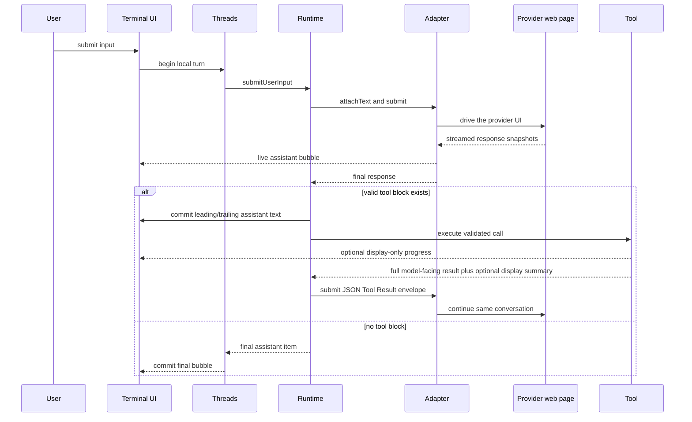

# Architecture

[Back to README](../README.md)

portal coordinates three execution environments:

1. an Ink terminal UI;
2. a local TypeScript/Node.js runtime with filesystem, process, Skill, and MCP access;
3. a real provider conversation in a Chromium browser.

Provider-specific website behavior stays behind adapters. The runtime understands tools, threads, cancellation, recovery, and external integrations; adapters understand navigation, selectors, provider protocols, uploads, model menus, and conversation history.

## Component map

| Area              | Main files                              | Responsibility                                                                                      |
| ----------------- | --------------------------------------- | --------------------------------------------------------------------------------------------------- |
| Process entry     | `src/index.ts`, `src/app.ts`            | Parse options, build services, run input dispatch, coordinate cancellation, and shut down           |
| Configuration     | `src/config/`                           | Create, validate, comment, lock, and atomically update `data/config.yaml`                           |
| HTTP API          | `src/api/`                              | Serve authenticated routes, thread operations, and per-thread SSE event streams                     |
| MCP Server        | `src/mcp-server/`                       | Expose selected thread operations through an independent Streamable HTTP MCP listener               |
| Browser platform  | `src/platform/`                         | Launch Chromium, connect over CDP, and manage platform-specific process lifetime                    |
| Provider adapters | `src/providers/adapters/`               | Navigate pages, detect login/readiness, submit, stream, upload, select models, and stop output      |
| History parsing   | `src/providers/conversation-history.ts` | Convert eight provider history formats into visible user/assistant messages                         |
| Runtime           | `src/runtime/`                          | Build setup prompts, initialize runtimes, execute tool loops, retry, recover, and cancel            |
| Threads           | `src/threads/`                          | Track open threads and local turns in memory; persist URL history metadata in SQLite                |
| Commands          | `src/cli-commands/`                     | Tokenize and dispatch slash commands                                                                |
| Tools             | `src/tools/`                            | Define schemas, render the tool protocol, validate calls, execute tools, and report progress        |
| Command processes | `src/processes/`                        | Track command jobs, bound output, and terminate process trees                                       |
| Terminal UI       | `src/terminal-ui/`                      | Manage home/thread timelines, live assistant/command bubbles, input history, wrapping, and keys     |
| Instructions      | `src/instructions/`                     | Discover optional Codex/Claude files, enforce read limits, and activate path-scoped rules           |
| Skills            | `src/skills/`                           | Validate manifests, install sources, maintain the registry, snapshot catalogs, and load content     |
| MCP               | `src/mcp/`                              | Parse config, connect per-thread clients, cache tools, call tools, and render attachments           |
| Hooks             | `src/hooks/`                            | Load immutable snapshots, run command/model handlers, gate Tool calls, and publish execution events |

Pure provider transport decoding lives outside the page adapters. For example, ChatGPT responses are decoded in `src/providers/chatgpt-response-parser.ts`.

## Startup lifecycle

`run()` in `src/app.ts` performs top-level orchestration:

1. Parse the browser engine, executable path, and remote debugging port.
2. Resolve `data/` from the current working directory.
3. Initialize missing `config.yaml` without overwriting existing user files.
4. Open `data/threads.db` and initialize its schema.
5. Create `ThreadManager`, the command registry, `TerminalController`, and Ink `TerminalScreen`.
6. Launch a dedicated Chromium process and connect through Playwright CDP.
7. Clear startup details and render command help on the home timeline.
8. Read terminal input until `/exit`, idle `Ctrl+D`, or terminal shutdown.
9. Close the browser connection, open runtimes, MCP clients, SQLite store, and Ink application with bounded shutdown waits.

On Windows, the launched browser is assigned to a Job Object. Closing the Job Object terminates the browser process tree even when ordinary child-process cleanup is insufficient. Other platforms use the generic Node child-process path.

The browser and portal share one lifecycle. Playwright's browser-level `disconnected` event covers browser process exit, crash, and CDP loss. An unexpected disconnect requests the same controlled shutdown used by `/exit`; portal-initiated browser closure is marked internally and does not trigger a second shutdown. Closing an individual provider page does not end the portal process. Instead, the base adapter reports an unexpected page close to the owning thread, which uses the normal coordinated close path.

## New runtime creation

A new thread uses this sequence:



The setup prompt is composed from:

- the shared tool invocation protocol and built-in tool definitions;
- enabled Skill names and descriptions, when the catalog is non-empty;
- successfully connected MCP Server and Tool names;
- the current working directory;
- enabled always-on project instructions;
- optional provider rules, currently used for Grok;
- a setup handshake instruction to reply with `READY`.

`load_skill` is registered only when the new runtime has at least one enabled valid Skill. MCP host tools are backed by the runtime's `ThreadMcpSession`.

## Resume lifecycle

Resume accepts a normalized provider URL or a `#history-id` resolved through `ThreadStore`.

1. Reject unsupported URLs and duplicate open conversations.
2. Create an adapter directly on the existing provider URL and wait for login/readiness.
3. Read the current Skills, MCP, and project-instruction configuration.
4. Build the runtime with `skipSetup: true`; no new setup/catalog turn is sent.
5. Register the thread and switch to its empty timeline.
6. Render the existing ready status bubble.
7. Load the provider's visible remote history and append user/assistant messages.
8. Render a Markdown warning if history is incomplete or unavailable.
9. Update the SQLite URL record.

The resumed web conversation already contains its provider-side context. Sending old messages again would duplicate context, so history hydration is display-only.

Resume creates one-time page/CDP history capture before navigation. The base adapter waits up to a short bounded interval for matching responses, reads their bodies, restores cache behavior, and releases the capture session. Individual parsers rebuild the provider's current branch and filter setup, tool, reasoning, partial, and control records. DeepSeek can return a nonempty `MERGE` cache delta; its adapter treats only `REPLACE` as complete and repeats a read-only full-history request inside the authenticated page using the original request headers when necessary.

Gemini follows its continuation cursor, Doubao follows `has_more`, and GLM accumulates `messages/batch` pages until the selected chain reaches the root, all under bounded progress and timeout loops. Qwen reads `GET /api/v2/chats/<id>` and establishes completeness only for the current active branch. Kimi reads structured `ListMessages` rows and reports a full 100-message page as incomplete because the page exposes no continuation cursor. ChatGPT, GLM, and Grok do not report complete when an indexed cell, parent/root, active leaf, or visible response body is missing.

A resumed conversation skips the setup handshake. It therefore assumes that the original conversation already contains a compatible portal tool protocol. Current Skill and MCP connections exist locally, but newly configured names are not injected as a new catalog turn. The resume path also does not attach the freshly read project-instruction snapshot to the resumed `RuntimeCore`, so it neither resends always-on instructions nor performs target-aware instruction activation for later tool calls in that thread.

## Turn and tool lifecycle



The textual protocol allows at most one `<tool>...</tool>` block in each assistant response. `ToolRegistry` parses the JSON outer shape, looks up the exact tool name, validates tool-specific input, and converts output into:

- `outcome`: `success`, `error`, or `unknown`;
- `result`: the complete JSON-serializable observation sent back to the web model;
- `displayText`: an optional compact terminal summary.

The runtime sends every result with the same model-facing shape:

```text
### Tool Result ###
{
  "tool": "tool_name",
  "outcome": "success",
  "result": {}
}
```

Before sending, the runtime measures the complete Tool Result envelope against
the active provider's composer limit. If the original result is too large, the
runtime preserves the tool's original `outcome`, keeps the full result in local
records and hooks, and sends a bounded replacement instead:

```text
### Tool Result ###
{
  "tool": "tool_name",
  "outcome": "success",
  "result": null,
  "delivery": {
    "status": "not_delivered",
    "code": "COMPOSER_LIMIT_EXCEEDED",
    "message": "The original tool result was not delivered because it exceeds the provider composer limit.",
    "measured": 200000,
    "limit": 163840,
    "unit": "utf16_code_units",
    "source": "verified_fallback",
    "confidence": "safe_cap"
  }
}
```

`outcome` describes tool execution. `delivery` appears only when the original
`result` was not included in the model-facing message; it does not replace or
modify the full local result.

The runtime can perform multiple tool rounds before the local turn completes.

### Live command progress

`run_command` and `spawn` emit display progress. Each progress event carries the runtime-generated `toolCallId`, so `TerminalController` can reject delayed start/output/result events from an older invocation. `run_command` reports a start event and decoded stdout/stderr chunks; `spawn` reports its start while the child runtime is active. The controller keeps one temporary bubble per thread, replaces it with the matching final result using the same timeline entry id, and discards it on cancellation, errors, thread switches, or thread removal. Timer and heartbeat callbacks also verify the current bubble identity before emitting.

Progress is display-only. Reporter errors cannot change command execution or the full structured tool result. Each invocation is registered in the process-local run-command job manager. Cancelling a turn detaches only that turn's waiter, so the job continues draining stdout/stderr and can be inspected with `/job` or stopped with `/job stop <job-id>`. On Windows, command processes use a Job Object where available; POSIX commands use a detached process group. Timeout, explicit stop, and controlled portal shutdown terminate the managed tree. Jobs are not persisted across portal restarts.

## Provider adapter boundary

All adapters implement these core operations:

- restore a new or existing provider page;
- report login and conversation identity;
- select a model by current menu position;
- attach text, files, and images;
- submit input and emit streamed/final text;
- expose supported page capabilities;
- load resume history;
- stop generation and close the page.

Provider completion and history formats differ. See [Providers](providers.md) for the current transport and URL matrix.

The base adapter installs fetch/XHR capture before navigation for submit flows. Resume additionally uses page response and CDP Network capture because some provider requests bypass page-level wrappers or arrive after composer readiness. Adapters remain the most volatile layer and should prefer stable, language-independent selectors and protocol completion signals.

## Thread state and timelines

Three stores serve different purposes:

| Store                        | Lifetime        | Contents                                                                 |
| ---------------------------- | --------------- | ------------------------------------------------------------------------ |
| `ThreadRegistry`             | Current process | Open runtimes, active id, local turns, assistant/tool/status/error items |
| `TerminalController` cache   | Current process | One home timeline plus one rendered timeline per open thread             |
| `ThreadStore` / `threads.db` | Persistent      | Provider, normalized conversation URL, title, created/last-used times    |

Switching a thread first saves the visible timeline under the previous key and restores the target array. It does not navigate or request remote history again. `detach` clears active selection and returns to the home timeline. Closing the active thread removes its cache and also returns home; closing a background thread keeps the current timeline visible. The same behavior applies when the user closes a provider tab directly. Any active operation is cancelled first, concurrent close requests share one close task, and portal makes two bounded settlement waits before force-closing the logical thread if the operation remains stuck. Page close events caused by portal shutdown are ignored by this thread-level path.

Remote resume history is rendered directly into the thread timeline. Its hydration is registered as a thread operation, so closing the provider page cancels hydration before removing the thread. History is not converted into `ThreadRegistry` turns, so local turn counts represent only inputs submitted during the current process. After startup completes, the home timeline receives one in-memory welcome entry; it is cached and restored like other home timeline entries.

The SQLite database is an index for reopening conversations, not a transcript database. The provider website remains the source of conversation content.

## Cancellation and recovery

Long-running app operations receive an `AbortSignal`.

- Busy `Ctrl+C` aborts the current operation and asks its active adapter/process to stop. A `run_command` process is an exception: the current waiter is cancelled, but the registered job continues until completion, timeout, `/job stop`, or portal shutdown.
- Idle `Ctrl+C` with non-empty input clears the input; idle empty `Ctrl+C` does nothing.
- Idle `Ctrl+D` with empty input requests shutdown.
- `/exit` requests the same shutdown path.

Provider failures are classified by kind, retryability, and recovery action. Authentication errors retain the adapter page and enter a login-wait loop. Ordinary retryable network/page failures use bounded retries and adapter restore. Explicit rate-limit errors and provider response activity timeouts instead keep the current payload and retry with 5, 10, 20, then capped 30 second delays until success, a retry preflight failure, or cancellation. This persistent path never restores the page: before each replay the adapter requires one empty editable Composer, no active stop control, an exact write/readback match, and one ready send control. A failure after writing but before dispatch clears every matching Composer; once dispatch starts, input is no longer rolled back. Other UI or protocol errors remain visible in the current timeline.

Cancellation is propagated through provider submit, runtime retries, tools, Skill installation, MCP requests, and app operations, except for the detached waiter behavior of `run_command` described above. Shutdown closes job admission and stops all active command jobs before closing providers. It uses bounded close waits so a hanging provider page or transport cannot block process exit indefinitely.

## Spawned runtimes

`spawn` creates a temporary child provider conversation in the existing browser context. It selects the requested provider or defaults to the parent provider, creates the normal Skill snapshot and independent MCP connections, forks the parent project-instruction snapshot, runs the standard setup handshake, executes one focused prompt synchronously, returns JSON containing provider, conversation URL, and output, then closes the child runtime.

Spawned conversations are not added to the normal thread list or SQLite history.

## Skills

The `skills` section of `data/config.yaml` is read for every Skill command and runtime creation. A valid enabled snapshot contributes a name/description catalog to new setup prompts and defines which names `load_skill` can resolve.

Catalog membership is immutable for an open runtime. The actual `SKILL.md` and resource list are read and validated on demand, so edits are visible to later loads while deleted or invalid files return errors. See [Skills](skills.md).

## Project instructions

The `agentInstructions` section is disabled by default. When enabled, new
runtimes load reviewed Codex and Claude Code files from configured global roots
and the current workspace. Always-on text joins the setup prompt; supported
file-targeting tool calls can activate nested instructions and path rules before
execution. Loader membership is snapshotted per runtime, while a child `spawn`
forks the parent's active state. See [Project Instructions](instructions.md).

## MCP

The `mcpServers` section of `data/config.yaml` configures outbound MCP clients.
Every new, resumed, or spawned runtime creates a `ThreadMcpSession` and
independent client transports for enabled valid servers. Failed servers are
omitted and rendered as Markdown warnings; successful servers continue normally.

Only connected Server and Tool names appear in the setup prompt. `mcp_search_tool` reads one exact cached definition, while `mcp_call_tool` dispatches one exact request. Tool list-change notifications refresh the current cache but do not rewrite the setup snapshot. Resource and Prompt commands operate through the active thread session and submit each attachment as its own user turn. See [MCP](mcp.md).

Closing a runtime closes its MCP clients and stdio child processes.

## Portal MCP Server

`src/mcp-server/` is independent from both the HTTP API and the outbound MCP
client code under `src/mcp/`. `/serve mcp start` creates a stateless Streamable
HTTP listener with fixed Portal tools. Its handlers call the same in-process
thread and runtime services used by the TUI; they do not call HTTP API routes.

MCP message submissions receive process-local operation ids so clients can
send, wait, and cancel without holding one request open for the full provider
turn. The thread operation coordinator prevents concurrent work on one thread
and uses operation-owned cancellation handles to avoid cancelling later work.
See [Portal MCP Server](mcp-server.md).

## Local data layout

```text
data/
├── profiles/chromium/
├── threads.db
├── config.yaml
├── skills/
└── temp/skill-install/
```

The repository's top-level `temp/` directory is separate. It contains provider fixtures, probes, screenshots, and other adapter-development artifacts and may include sensitive conversation data.

See [Configuration](configuration.md) for the ownership and reload behavior of
each `config.yaml` section.
