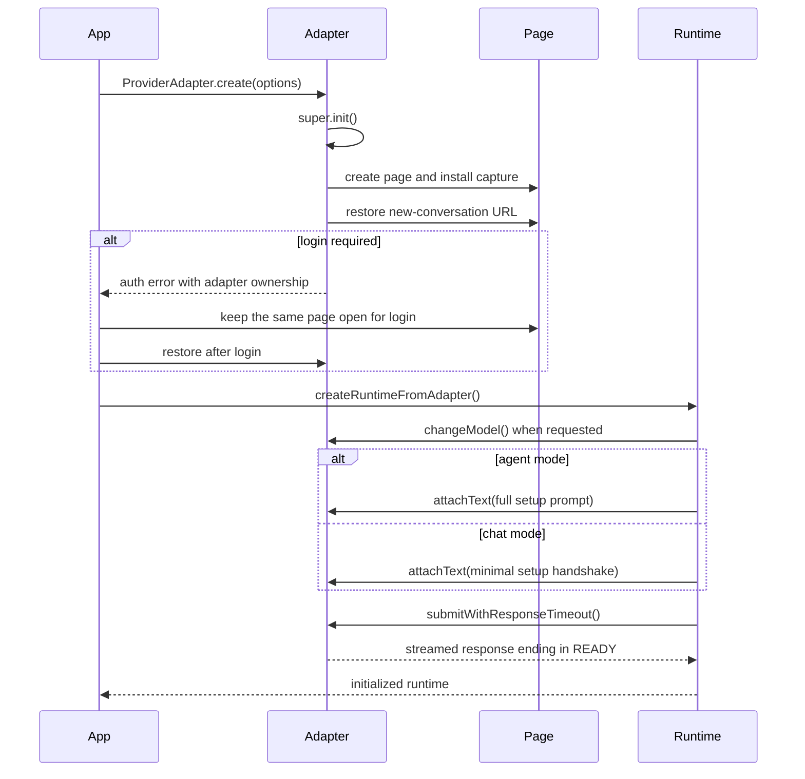
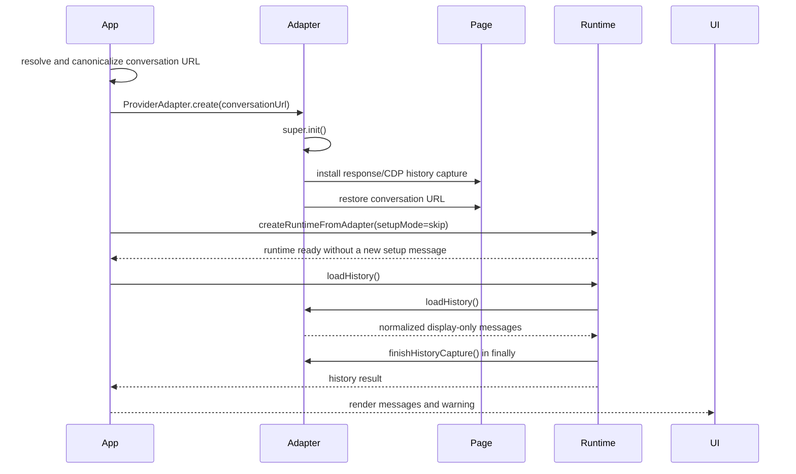

# Provider Development

[Providers](providers.md) | [Architecture](architecture.md) | [Testing](testing.md) | [Security](security.md) | [Contributing](contributing.md)

This guide is the implementation and review checklist for adding a web AI Provider to portal. It documents the current repository contracts; it does not make private Provider routes, DOM structures, or protocols stable.

portal automates the normal web product in a real Chromium page. A Provider integration must not replace that boundary with a model API.

## 1. Scope and definition of done

A first-class Provider is complete only when all applicable paths below work:

- `/providers`, `/thread agent`, `/thread chat`, Spawn, HTTP API, and Portal MCP Server expose the Provider;
- a signed-in page can create a new agent or chat conversation and complete its setup `READY` handshake;
- signed-out, restricted, and unexpected page states are classified without leaking raw browser errors;
- normal turns stream, terminate, cancel, and leave the page reusable;
- model selection, file/image upload, and capabilities either work or return an explicit unsupported result;
- `/thread resume` accepts and canonicalizes the Provider URL, skips setup, and renders display-only history when completeness can be proved; otherwise it reports a useful incomplete-history warning while keeping the thread usable;
- focused tests cover selectors, protocol parsing, failure states, cleanup, and registration;
- a real-profile smoke check covers the web paths affected by the integration;
- English and Chinese entry documentation stays synchronized.

An adapter can be merged with an intentionally unsupported feature, but it cannot silently omit an abstract method or claim support that was not verified.

## 2. Adapter lifecycle

The diagrams below show the lifecycle from an adapter author's perspective. See [Architecture](architecture.md) for the wider process, Tool, thread, and MCP design.

### New conversation



`READY` is a Runtime handshake, not a DOM readiness signal. The response must contain `READY` as a case-insensitive whole word. The adapter must prove that the page is ready before the Runtime writes either setup prompt.

### Resumed conversation



Resume reconnects the current MCP configuration and snapshots current Skills, but it does not send a new setup catalog into the existing conversation. Current project instructions are available to child services such as Spawn but are not inserted into the resumed Runtime prompt. Remote history is shown in the terminal only: it is not submitted to the model again, inserted into runtime turns, or persisted as transcript data.

## 3. Reconnaissance and privacy

Do not start with selectors. First establish the Provider's observable state machine and request ownership.

### Page reconnaissance

Record sanitized answers for:

1. New-conversation and canonical conversation URLs.
2. Signed-in, signed-out, intermediate redirect, restricted, and expired-session pages.
3. The earliest reliable page-ready signal.
4. Model selection and whether menu positions vary by account.
5. File/image upload controls and accepted file behavior.
6. Optional capabilities and their enabled, disabled, selected, and unavailable states.
7. The request that proves a submit was accepted.
8. Streaming chunks, continuation streams, terminal events, stop reasons, and errors.
9. History source, pagination or graph rules, current branch, and completeness evidence.
10. Stop/cancel controls and the state visible after completion.

Check the states that are safely available: signed in and signed out, new and existing conversations, short and long histories, responsive windows, and relevant account tiers. Do not manufacture a ban, rate limit, purchase, or destructive account state solely for a smoke test.

### Evidence and private data

- Prefer DevTools or Playwright observations of network and DOM behavior over assumptions from appearance.
- Keep raw captures, screenshots, probes, and temporary fixtures under ignored `temp/` paths.
- Convert a required fixture into the smallest sanitized sample that still proves the parser behavior.
- Never commit cookies, authentication headers, browser profiles, private conversation URLs, user prompts, or raw personal transcripts.
- Treat Provider pages and responses as untrusted input. Review the trust boundary in [Security](security.md).
- Check the Provider's current automation terms and account policies before relying on the integration.

## 4. Registration checklist

Adding the adapter file is only one part of registration. Search for exhaustive `ProviderId` unions, arrays, records, switches, and schema enums before considering registration complete.

| Area               | Required change                                                                                                                                                                          |
| ------------------ | ---------------------------------------------------------------------------------------------------------------------------------------------------------------------------------------- |
| Adapter            | Add `src/providers/adapters/adapter-<id>.ts`, delegate page behavior to Provider UI components, and add focused semantic tests under `test/providers/adapters/`.                         |
| Provider UI        | Add Provider-local components under `src/providers/ui/<id>/`; keep selector candidates, DOM scoping, uniqueness, waits, actions, and page state inside this boundary.                    |
| Provider type      | Add the id to `src/providers/provider-id.ts`.                                                                                                                                            |
| App registry       | In `src/app.ts`, add the import, `PROVIDERS` entry, normalized name/aliases, `createAdapterForProvider` case, and a Provider prompt only when the Provider needs an extra boundary.      |
| Resume URL         | Add strict HTTPS host/path recognition and canonicalization in `src/providers/provider-conversation-url.ts`, with positive, alias, malformed-encoding, wrong-host, and wrong-path tests. |
| Hooks              | Add the id to Provider normalization in `src/hooks/hook-config.ts` and update Hook tests.                                                                                                |
| Spawn              | Update the Provider list in the `spawn` description and input-schema enum in `src/tools/builtins/spawn-tool.ts`; update `test/tools/builtins/spawn-tool.test.ts`.                        |
| Model argument     | Add the Provider's named models and per-model options to `src/providers/definitions/<id>.ts`; cover mapping and rejected forms in manifest, catalog, and command tests.                  |
| Capabilities       | Put only static capability keys, descriptions, and kinds in the Provider definition; keep live discovery and dispatch behavior in the Provider UI component.                             |
| User documentation | Update the brief lists in `README.md` and `docs/README.zh-CN.md`, plus the detailed matrix/counts in [Providers](providers.md); other docs only when needed.                             |
| Integration tests  | Update Provider lists, command completion, API/MCP listing, and any exhaustive records surfaced by TypeScript or repository search.                                                      |

Do not add an alias unless it is unambiguous and useful. Canonical conversation URLs must discard unrelated query/hash state and encode the conversation id exactly once.

## 5. Adapter contracts, selectors, and readiness

### Required and optional contracts

`ProviderAdapter` requires every concrete adapter to implement:

- `restore(options)`;
- `isLoggedIn()`;
- `conversationId` and `conversationUrl`;
- `changeModel(model)`;
- `attachText(text)`;
- `attachFile(path)`;
- `attachImage(path)`;
- `submit(options)`.

`changeModel`, `attachFile`, and `attachImage` are required TypeScript methods even when the website does not support the operation. In that case, throw `ProviderAdapterUnsupportedError` with a clear action and message.

`loadHistory()` and `stopGeneration()` have base implementations and may be overridden. A first-class Provider should implement history when the web product exposes enough information to prove completeness. Override `stopGeneration()` when the Provider exposes a safe stop control.

Capabilities are optional structural interfaces, not base-class methods:

- toggle Providers expose `hasToggleCapability`, `getToggleState`, and `setToggleState`;
- action Providers expose `listActionCapabilities`, `selectActionCapability`, and optionally `clearActionCapability`.

Do not invent a capability that the current page does not expose. Account- or experiment-dependent controls must be discovered at runtime.

The TypeScript definitions under `src/providers/definitions/` are imported as
one strict immutable domain snapshot. Definitions contain public model keys,
model option keys, and static capability metadata. They do not contain selector
candidates, menu positions, DOM targets, or Adapter dispatch instructions.

Provider-local Page Component Objects under `src/providers/ui/<id>/` own the
page boundary: static CSS candidates, owner scoping, uniqueness and visibility,
dynamic selector construction, waits, clicks, and UI state verification. A
simple Provider may use one UI component; a complex Provider may split auth,
Composer, model, capability, attachment, and response concerns into focused
components. Do not introduce a cross-Provider page-object inheritance tree.

Adapters must not call `page.locator`, query the Provider DOM, or import selector
helpers. They delegate page behavior to their Provider UI component and retain
the semantic `ProviderAdapter` contract, navigation, network/protocol capture,
response parsing, and history coordination.

Static candidates registered through `defineProviderUiSelectors` are raw CSS,
not an interaction DSL. Do not store `:visible`, XPath, comma unions, Playwright
text engines, owner selection, `first`/`last`/`nth`, clicks, waits, or state
checks in the selector tree. Text-bearing attributes such as `aria-label`,
`title`, `placeholder`, and `alt` are rejected along with visible-text selector
syntax. A verified XPath that cannot be expressed safely as CSS must remain a
documented local exception beside the behavior that uses it.

Adapter and UI behavior tests must use independent fixtures or local selector
oracles; they must not import the production selector tree. This prevents a
production selector and its test from changing incorrectly in lockstep. Only a
real browser smoke test proves that a selector still matches the upstream page.

### Initialization order

If an adapter overrides `init`, it must call `super.init(options)` before any restore or navigation. The base initializer:

1. creates the page;
2. installs page-response and CDP history capture for resume;
3. installs fetch/XHR capture before Provider requests begin.

Changing this order can make history or submit requests permanently unobservable.

### Selector rules

Selector and readiness rules are review gates, not preferences.

1. Put all Provider DOM access in `src/providers/ui/<id>/`; runtime and Adapter code consume semantic methods only.
2. Prefer signals in this order: protocol/network events, stable data attributes, scoped DOM structure or roles, then a verified stable SVG signature.
3. Do not identify state or control identity with visible text, translated labels, `getByText`, `hasText`, Accessible Name, or `aria-label`. `aria-label` is text and can change with copy or locale.
4. Do not use rendered `width`, `height`, coordinates, spacing, or screen position. They change with responsive layout, zoom, fonts, and experiments.
5. SVG matching must be scoped to the owning component and use only a verified stable prefix. Prefer `svg[viewBox^="0 0 21.2"]` over an exact match to the full SVG attribute or path.
6. `viewBox` is an intrinsic icon signature, not a rendered responsive width or height. Do not substitute CSS dimensions for it.
7. Require a unique, visible target. Verify `count === 1` before selecting the target. Check enabled or accessibility state only when the Provider's verified control semantics require it; an empty Composer may intentionally keep its send button disabled while the page is ready.
8. `aria-disabled` is optional state data. It may be read after identity is established, but it is neither required on every site nor valid as the control's identity.
9. Scope selectors to a stable owner such as the Composer, model menu, or response article. Do not search the whole page for a common icon or role.
10. Generated CSS class names and exact class strings are fragile. Use a stable class fragment only when verified and when no stronger signal exists.
11. If only text or responsive geometry is available, stop and document the limitation for review instead of silently adding the selector.

Example of a structurally scoped icon signal:

```ts
const controls = composer.locator('button:has(svg[viewBox^="0 0 21.2"])')
if ((await controls.count()) !== 1) return false
const control = controls.first()
return await control.isVisible()
```

### State separation

Keep these signals independent:

- login or account-access state;
- page readiness;
- Composer editability;
- request accepted;
- streaming activity;
- protocol completion;
- Composer ready after completion.

Login and restricted-state checks have priority over Ready. An editable Composer is not sufficient evidence of Ready because it can appear briefly before an authentication redirect. Recheck authentication around Composer actions and after submit while no owned request has appeared.

When login is required, throw an auth `ProviderAdapterError` with `adapter: this` so initialization can keep the same page open. Account restriction or another state that login cannot fix needs a separate recovery plan; do not put it into an infinite login-wait loop.

## 6. Submit and resume history

### Submit ownership and completion

The submit path must keep three states separate: the UI action succeeded, the adapter reached its Provider-specific dispatch point, and an owned Provider request was observed.

1. Capture a baseline before the click or Enter press so stale requests cannot satisfy the new turn.
2. Check login/access and Composer readiness before editing and before submit.
3. Filter captured traffic by method, endpoint, conversation, request shape, and capture id as available.
4. While no owned request exists, continue checking redirects and blocked UI state.
5. After an owned request exists, do not reclassify an empty poll as authentication failure and do not submit again.
6. Call `emitSubmitSent` at the adapter's Provider-specific dispatch point so the base response-start timeout begins. Most current adapters use a successful click or Enter press. This reporter does not have one universal meaning and must not be treated as owned-request evidence.
7. Emit activity only for real network, stream, or text progress. `emitSubmitText` already counts as activity. UI polling must not extend the stall timeout.
8. Stream monotonic text snapshots through `emitSubmitText`; do not make the terminal wait for the final response when safe incremental text exists.
9. Require Provider-specific terminal evidence such as an SSE terminal event, WebSocket done event, terminal stop reason, or verified final response. DOM text stability alone is not a protocol completion signal when a stronger event exists.
10. Handle tool-use or continuation streams until the final assistant text terminates.
11. Verify the Composer is usable after completion before returning when that is part of the Provider contract.
12. Remove listeners and timers in `finally`, and propagate the abort signal through polling, parsing, and waits.

If it is uncertain whether a submit reached the Provider, report an unknown outcome and do not mark it automatically retryable. Runtime retry performs another attach-and-submit cycle and can create a duplicate user message.

Runtime retries only Provider errors explicitly marked `retryable` with a finite `maxAttempts`. A response timeout is an unknown submit outcome and is never replayed automatically, because the original request may already have reached the Provider. Do not use a retry transaction to replay a timed-out or otherwise ambiguous submission.

Before writing, require exactly one visible, editable, empty Composer and no active stop control. After writing, read back the exact payload, check the stop control again, and require one visible enabled send control. Call `emitSubmitDispatching()` immediately before invoking the click or key action. Any failure or cancellation from the start of writing until that marker must clear all current matching Composer nodes; a cleanup failure is terminal. Never clear after the marker because dispatch may have reached the Provider.

`stopGeneration()` should target one scoped, visible stop control. Cancellation means portal stopped waiting and attempted Provider-side stop; it cannot prove that the remote request had no side effects.

### History source and completeness

Prefer structured history responses over rendered DOM. Use virtualized DOM collection only when the Provider does not expose a reliable structured response.

Keep capture, parsing, and normalization separate:

- capture only responses owned by the resumed conversation;
- parse sanitized bodies with deterministic functions;
- normalize only visible `user` and `assistant` messages;
- keep stable parent ids and the current branch;
- filter setup handshakes, tool/control nodes, reasoning, partial content, and UI chrome;
- preserve Markdown meaning without copying interactive labels into the transcript.

Completeness must have Provider-specific evidence:

- pagination reaches `has_more=false` or an empty continuation cursor;
- a graph reaches its root and verified current leaf;
- every virtual cell from zero through the stable terminal index was collected;
- replayed cache deltas are replaced by a complete snapshot when required.

Wait for observed progress, not a blind fixed delay. Reset a bounded quiet window when an index/cursor grows or a snapshot becomes invalid. Stop with `complete: false` and a useful warning when ownership, ordering, branches, bodies, or terminal state cannot be proved. `RuntimeCore.loadHistory()` owns the final `finishHistoryCapture()` call in `finally`; Provider code must not release capture before its last read, and any adapter-local cleanup must remain idempotent.

Resume history is display-only. Never feed it back to the model, store it as local turns, or claim completeness from the visible viewport alone.

## 7. Errors, recovery, and cancellation

Use `ProviderAdapterError` metadata deliberately:

| Kind          | Use                                                                                             |
| ------------- | ----------------------------------------------------------------------------------------------- |
| `unsupported` | The requested operation is not provided by this page/model/account.                             |
| `auth`        | Login or authentication is required and the same adapter page should be retained.               |
| `transient`   | A temporary page/network failure is safe to retry only when duplicate submission is impossible. |
| `ui`          | Expected Provider UI structure or state is unavailable or ambiguous.                            |
| `protocol`    | Captured data is malformed, incomplete, or violates completion rules.                           |
| `rate_limit`  | The Provider explicitly reported a rate or quota limit.                                         |
| `unknown`     | The failure cannot be classified safely.                                                        |

Recovery actions are `none`, `retry`, `restore`, and `reload`. In current application recovery, both `restore` and `reload` lead through the adapter's `restore()` path; `reload` does not promise a direct `page.reload()`. Runtime-internal retry performs a pre-retry restore only for `recovery: 'restore'`.

Rules:

- Set `retryable` only when replay is known to be safe and bound `maxAttempts`.
- Keep a stable, searchable `detailCode` for tests and recovery plans.
- Convert raw Playwright/DOM errors into a clean user-facing message; retain the original error only as `cause`.
- Do not surface locator call logs, private URLs, request headers, or response bodies in terminal errors.
- Keep auth errors attached to the adapter. Keep non-login-recoverable access states out of login wait.
- Treat protocol ambiguity and unknown submit outcomes as non-retryable. Only a Provider error with explicit evidence that replay is safe may set `retryable: true`, and it must also provide a finite `maxAttempts`.
- Propagate `AbortSignal` and preserve `isAbortError` rather than wrapping cancellation as a Provider failure.

## 8. Validation

### Automated test matrix

Use `node:test`, existing fake-page helpers, and sanitized protocol fixtures. Add only the layers affected by the Provider.

| Area            | Minimum evidence                                                                                                                                                                                             |
| --------------- | ------------------------------------------------------------------------------------------------------------------------------------------------------------------------------------------------------------ |
| Registration    | Provider lists, aliases, Spawn enum, Hooks, model grammar, API/MCP listing, and command completion include the new id.                                                                                       |
| URL             | Valid and alias URLs canonicalize; wrong scheme/host/path, empty ids, encoded ids, queries, and hashes are handled safely.                                                                                   |
| Login and Ready | Signed in, signed out, redirect race, restricted/unrecoverable state, missing/duplicate controls, disabled state, and Composer-before-Ready behavior.                                                        |
| Selectors       | The real scoped locator path is exercised; text/`aria-label` and responsive geometry are not used as hidden test shortcuts.                                                                                  |
| Model           | Accepted named keys/options, Provider-local UI mapping and order, unavailable entries, selection verification, menu cleanup, and unsupported behavior.                                                       |
| Upload          | File and image paths, multiple files where supported, missing/disabled controls, and no false success claim.                                                                                                 |
| Submit          | Stale baseline, request ownership, delayed start, streaming, tool continuations, HTTP/protocol errors, partial/multiple streams, terminal state, timeout, and no duplicate retry after uncertain acceptance. |
| Cancellation    | Abort propagation, Provider stop attempt, listener/timer cleanup, and reusable page state.                                                                                                                   |
| History         | Complete and incomplete responses, root/leaf/current branch, pagination progress/no-progress, virtualization, empty/duplicate/conflicting cells, content filtering, and capture cleanup.                     |
| Capabilities    | Available, unavailable, disabled, selected, cleared, idempotent toggle, menu cleanup, and account-dependent omission.                                                                                        |
| Errors          | Kind, recovery, retryability, `detailCode`, adapter ownership, clean message, and hidden raw cause.                                                                                                          |

Focused tests should fail on the reproduced bug before the implementation is accepted. Test semantics and protocol ownership, not a reimplementation of the production parser inside the fake.

Run the repository checks from [Testing](testing.md):

```bash
npm run test:type
npm run test:unit
npm run lint
npm run fmt:check
npm run test:coverage
```

Coverage is a diagnostic baseline, not proof that the live Provider website still matches the adapter.

### Real-profile smoke matrix

CI does not log in to Provider websites. Use a dedicated profile and record only pass/fail facts, never private content.

1. Create a new signed-in agent thread and complete the full setup `READY` handshake.
2. Create a chat thread and verify that it sends only the minimal handshake and accepts a case-insensitive whole-word `READY` response.
3. Verify signed-out/login redirect behavior without sending setup early.
4. Submit a normal turn; verify request start, monotonic streaming, completion, and a second usable turn.
5. Exercise a real Tool call and any Provider continuation stream.
6. Select a model and verify the selected state when the Provider supports it.
7. Upload file/image content and verify page acknowledgement where safely observable.
8. List, select/toggle, clear, and re-list capabilities when applicable.
9. Cancel a live response and verify the page remains usable.
10. Resume a short and long history; verify current branch, ordering, filtered controls, and incomplete warnings.
11. Check restricted, rate-limit, or account-tier behavior only when that state already exists and can be tested safely.
12. Close/detach the thread and exit; verify listeners, pages, browser ownership, and child processes clean up.

State any unrun smoke path explicitly in the final report. Unit tests cannot substitute for an upstream DOM/protocol check.

## 9. Repository workflow and final checklist

The repository [AGENTS.md](../AGENTS.md) is authoritative. Provider work follows these gates:

1. Clarify scope, supported behavior, constraints, and acceptance criteria.
2. Read relevant documentation, code, tests, branch state, and current worktrees.
3. Research the real Provider behavior and established repository patterns.
4. Have the implementation plan reviewed, address findings, and obtain explicit user approval.
5. Create a dedicated branch/worktree and make only the approved changes.
6. Have the actual diff and tests reviewed; fix blocking findings and repeat review when necessary.
7. Run required tests, type checks, lint, format, coverage, and applicable real smoke checks.
8. Commit, merge, verify the target tree, and remove only the task-owned worktree and branch.

Final review:

- [ ] The Provider drives the real web product, not a model API.
- [ ] Every registration point and exhaustive Provider list is updated.
- [ ] Required adapter methods exist; unsupported operations fail explicitly.
- [ ] Provider DOM selectors and interactions live in Provider UI components; Adapter and runtime code use semantic methods and contain no Provider DOM queries.
- [ ] Provider definitions contain domain metadata only; UI positions, selector candidates, and dispatch targets are not public domain fields.
- [ ] Login, restricted access, Ready, request start, streaming, completion, and post-completion readiness are separate.
- [ ] No selector depends on text, `aria-label`, Accessible Name, rendered size, coordinates, or responsive position.
- [ ] Adapter/UI tests use independent fixtures or local oracles rather than importing production selector trees.
- [ ] SVG identity is scoped and prefix-matched; targets are unique and visible, with Provider-specific enabled state handled according to verified page semantics.
- [ ] Submit ownership excludes stale/unrelated traffic and uncertain outcomes cannot duplicate messages.
- [ ] Streaming, continuation, completion, cancellation, and cleanup use real protocol evidence.
- [ ] Resume history proves completeness when reported complete; otherwise it warns, filters non-message content, and remains display-only.
- [ ] Error metadata, retry policy, recovery, adapter ownership, and user-facing messages are safe and tested.
- [ ] Focused tests and applicable real-profile smoke paths pass, or limitations are explicit.
- [ ] English/Chinese support documentation is synchronized and contains no private data.
- [ ] Plan review, implementation review, commit, merge, and worktree cleanup are recorded.
